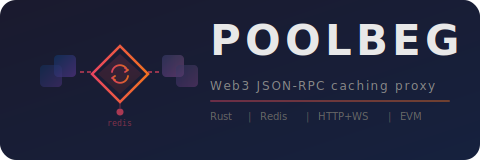

<div align="center">

<picture>
  
</picture>

<br/><br/>

[](https://github.com/your-org/meddler/actions/workflows/ci.yml)
[](https://github.com/your-org/meddler/actions/workflows/docker.yml)
[](LICENSE)
[](https://www.rust-lang.org)

</div>

---

Meddler sits between your app and upstream EVM RPC nodes (Infura, Ankr, self-hosted), providing **Redis-backed caching**, **WebSocket subscription fan-out**, and **automatic upstream failover**. Clients connect to meddler as a drop-in replacement — zero code changes needed.

## Features

- **Drop-in replacement** — works with ethers.js, viem, web3.py, geth attach, any Web3 library
- **HTTP + WebSocket** on a single port
- **Redis cache** with finality-aware TTLs — finalized data cached long, head data expires fast
- **Cache-driven subscriptions** — `eth_subscribe(newHeads)`, `logs` served from cache, not upstream WS
- **Role-based upstream failover** — primary / secondary / fallback tiers with round-robin
- **Block tracker** — polls chain head, caches blocks + logs proactively, detects reorgs
- **Multi-chain** — serve Arbitrum, Ethereum, any EVM chain from one instance
- **Prometheus metrics** — requests, cache hits, upstream health, WS connections
- **Helm chart** — Redis sidecar, external secrets support, HPA, ServiceMonitor

## Quick Start

```bash
# Clone and configure
git clone https://github.com/your-org/meddler.git
cd meddler
cp .env.example .env
# Edit .env with your Infura key (or other provider)

# Run with Docker Compose
docker compose up --build
```

Meddler is now listening:
- **HTTP** — `http://localhost:8080/arbitrum`
- **WebSocket** — `ws://localhost:8080/arbitrum`
- **Metrics** — `http://localhost:9090/metrics`
- **Health** — `http://localhost:8080/health`

### Test it

```bash
# HTTP JSON-RPC
curl -s http://localhost:8080/arbitrum \
  -d '{"jsonrpc":"2.0","method":"eth_blockNumber","params":[],"id":1}'

# WebSocket (install wscat: npm i -g wscat)
wscat -c ws://localhost:8080/arbitrum
> {"jsonrpc":"2.0","method":"eth_subscribe","params":["newHeads"],"id":1}
> {"jsonrpc":"2.0","method":"eth_blockNumber","params":[],"id":2}
```

### Use with ethers.js

```javascript
import { ethers } from "ethers";

// HTTP
const http = new ethers.JsonRpcProvider("http://localhost:8080/arbitrum");
const block = await http.getBlockNumber();

// WebSocket with subscriptions
const ws = new ethers.WebSocketProvider("ws://localhost:8080/arbitrum");
ws.on("block", (blockNumber) => console.log("new block:", blockNumber));
```

## Configuration

Meddler uses a YAML config file with `${VAR}` and `${VAR:-default}` environment variable interpolation.

```yaml
server:
  address: "0.0.0.0"
  port: 8080
  metrics:
    port: 9090

cache:
  redis:
    url: "${REDIS_URL:-redis://localhost:6379}"
    pool_size: 16
  policies:
    # Finalized data — cache permanently (evicted by Redis LRU)
    - methods: ["eth_getBlockByHash", "eth_getTransactionByHash"]
      finality: finalized
      ttl: "0"
    # Head data — short TTL
    - methods: ["eth_getBlockByNumber", "eth_getBalance"]
      finality: unfinalized
      ttl: "2s"
    # Never cache
    - methods: ["eth_sendRawTransaction", "eth_estimateGas", "eth_call"]
      finality: any
      ttl: "-1"

chains:
  - name: ethereum
    chain_id: 1
    expected_block_time: "12s"
    finality_depth: 64
    route: /ethereum
    upstreams:
      - id: infura-eth
        role: primary
        http_url: "https://mainnet.infura.io/v3/${INFURA_KEY}"
        max_rps: 50
      - id: public-eth
        role: fallback
        http_url: "https://ethereum-rpc.publicnode.com"
        max_rps: 10

  - name: arbitrum
    chain_id: 42161
    expected_block_time: "250ms"
    finality_depth: 100
    route: /arbitrum
    upstreams:
      - id: infura-arb
        role: primary
        http_url: "https://arbitrum-mainnet.infura.io/v3/${INFURA_KEY}"
        max_rps: 50
      - id: public-arb
        role: fallback
        http_url: "https://arbitrum-one-rpc.publicnode.com"
        max_rps: 10
```

### Example configs

| Config | Description |
|--------|-------------|
| [`config.example.yaml`](config.example.yaml) | Ethereum mainnet + Arbitrum One |
| [`config.arbitrum-sepolia.yaml`](config.arbitrum-sepolia.yaml) | Arbitrum Sepolia testnet |

### Cache TTL values

| Value | Meaning |
|-------|---------|
| `"0"` | Cache forever (no expiry, evicted by Redis LRU under memory pressure) |
| `"3s"` | Cache for 3 seconds (supports `ms`, `s`, `m`, `h`) |
| `"-1"` | Never cache, always forward to upstream |

### Upstream roles

| Role | Behavior |
|------|----------|
| `primary` | Tried first, round-robin within tier |
| `secondary` | Used when all primaries are unhealthy |
| `fallback` | Last resort |

## Architecture

```
    Clients (ethers.js, viem, web3.py, etc.)
         HTTP POST        WS eth_subscribe
              │                  │
              ▼                  ▼
        ┌──────────────────────────┐
        │   axum (single port)     │
        │   HTTP handler │ WS      │
        └────────────┬─────────────┘
                     │
        ┌────────────▼─────────────┐
        │    Cache Layer (Redis)   │
        │  ┌─────────────────┐     │
        │  │  Block Tracker  │     │  polls upstreams, caches
        │  │  (per chain)    │─────│  blocks + logs, emits events
        │  └────────┬────────┘     │
        │  ┌────────▼────────┐     │
        │  │  Subscription   │     │  reads from cache,
        │  │  Manager        │─────│  fans out to WS clients
        │  └─────────────────┘     │
        └────────────┬─────────────┘
                     │
        ┌────────────▼─────────────┐
        │   Upstream Manager       │
        │   primary → secondary    │
        │         → fallback       │
        └──┬─────┬─────┬─────┬────┘
           │     │     │     │
         node  node  infura  ankr
```

## Deployment

### Docker

```bash
docker build -t meddler .
docker run -p 8080:8080 -p 9090:9090 \
  -v $(pwd)/config.example.yaml:/etc/meddler/config.yaml \
  -e INFURA_KEY=your_key \
  -e REDIS_URL=redis://your-redis:6379 \
  meddler
```

### Docker Compose

```bash
cp .env.example .env   # add your INFURA_KEY
docker compose up --build
```

### Helm

```bash
helm install meddler ./charts/meddler \
  --set secrets.INFURA_KEY=your_key

# Or with an existing secret (External Secrets Operator, Sealed Secrets, etc.)
helm install meddler ./charts/meddler \
  --set existingSecret=my-rpc-keys
```

The Helm chart deploys meddler with a **Redis sidecar** by default (like [dshackle](https://github.com/emeraldpay/dshackle)).

### Build from source

```bash
cargo build --release
./target/release/meddler --config config.example.yaml
```

## Metrics

Meddler exposes Prometheus metrics on a separate port (default `9090`):

| Metric | Type | Description |
|--------|------|-------------|
| `meddler_requests_total` | counter | Total JSON-RPC requests `{chain, method, status, cache_hit}` |
| `meddler_cache_hits_total` | counter | Cache hits `{chain, method}` |
| `meddler_cache_misses_total` | counter | Cache misses `{chain, method}` |
| `meddler_upstream_healthy` | gauge | Upstream health `{chain, upstream_id}` (1=up, 0=down) |
| `meddler_upstream_block_height` | gauge | Latest block per upstream `{upstream_id}` |
| `meddler_chain_head_block` | gauge | Chain head block number `{chain}` |
| `meddler_ws_active_connections` | gauge | Active WebSocket connections `{chain}` |
| `meddler_ws_active_subscriptions` | gauge | Active subscriptions `{chain, subscription_type}` |

## Inspired by

- [dshackle](https://github.com/emeraldpay/dshackle) — Ethereum API load balancer (Kotlin)
- [eRPC](https://github.com/erpc/erpc) — EVM RPC proxy (Go)
- [blutgang](https://github.com/rainshowerLabs/blutgang) — Ethereum RPC load balancer (Rust)

## License

MIT
